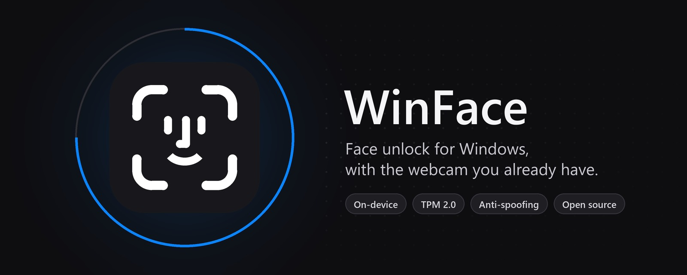
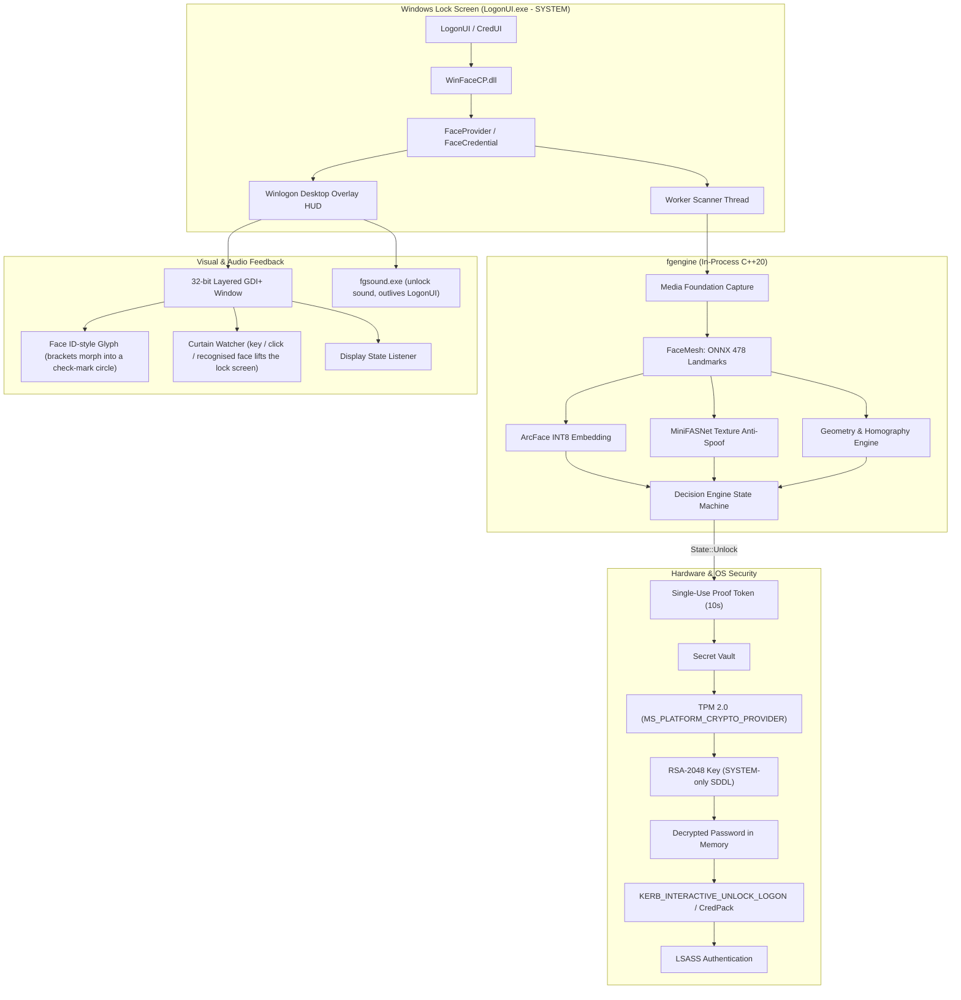

<p align="center">
  
</p>

<h1 align="center">WinFace</h1>

<p align="center">
  <b>Face unlock for Windows 10 and 11 - like Face ID, with the webcam you already have.</b><br>
  On-device, private, and protected against photos and videos.
</p>

<p align="center">
  <a href="https://github.com/nyxri0f8/winface/releases/latest"></a>
  
  <a href="PRIVACY.md"></a>
</p>

<p align="center">
  <a href="https://github.com/nyxri0f8/winface/releases/latest"><b>Download WinFace-Setup</b></a> &nbsp;·&nbsp;
  <a href="#quick-install-winface-setupexe">Install guide</a> &nbsp;·&nbsp;
  <a href="PRIVACY.md">Privacy policy &amp; warning</a>
</p>

WinFace provides fast, secure facial recognition logon for standard RGB webcams without requiring proprietary infrared (IR) sensors. It integrates natively into Windows `LogonUI.exe` using a custom C++20 Credential Provider, backed by hardware TPM 2.0 key isolation, on-device neural network inference, and multi-layered anti-spoofing based on 3D geometric parallax.

---

> **IMPORTANT WARNING AND SAFETY GUARANTEE**
>
> WinFace **never** hides, modifies, or disables your standard Windows PIN or password tiles.
> If facial verification fails, times out, or the camera is unavailable, you can always click **Sign-in options** on the lock screen and enter your PIN or password as usual.
>
> A complete, offline emergency recovery procedure is included in this repository and installed alongside the binaries in `RECOVERY.md`.

---

## Table of Contents

- [Architectural Overview](#architectural-overview)
- [Security Architecture & Threat Model](#security-architecture--threat-model)
  - [Hardware TPM 2.0 Cryptographic Vault](#1-hardware-tpm-20-cryptographic-vault)
  - [Zero-IPC In-Process Execution](#2-zero-ipc-in-process-execution)
  - [Single-Use Proof Token](#3-single-use-proof-token)
  - [Memory Hygiene](#4-memory-hygiene)
  - [Mathematical 3D Parallax Anti-Spoofing](#5-mathematical-3d-parallax-anti-spoofing)
  - [Camera Hardware Enforcement](#6-camera-hardware-enforcement)
- [System Architecture Diagram](#system-architecture-diagram)
- [Verification & Anti-Spoofing Pipeline](#verification--anti-spoofing-pipeline)
- [Project Layout](#project-layout)
- [Privacy: Everything Stays on Your PC](#privacy-everything-stays-on-your-pc)
- [Quick Install (WinFace-Setup.exe)](#quick-install-winface-setupexe)
- [The WinFace App](#the-winface-app)
- [Building the Installer](#building-the-installer)
- [Installation Guide (from source)](#installation--setup-guide-step-by-step)
- [Command-Line Reference](#command-line-reference)
- [Configuration Settings](#configuration-settings)
- [Troubleshooting & Logs](#troubleshooting--logs)
- [Emergency Recovery Procedure](#emergency-recovery-procedure)
- [Credits](#credits)

---

## Architectural Overview

Standard Windows Hello Face requires specialized depth-sensing or infrared cameras (850nm/940nm LEDs). Most consumer laptops and external monitors only feature standard 720p or 1080p RGB webcams.

WinFace bridges this gap by combining modern computer vision with low-level Windows authentication internals:

- **Native Credential Provider V2**: Implements `ICredentialProvider`, `ICredentialProviderCredential2`, and `ICredentialProviderSetUserArray` directly in C++20.
- **In-Process ONNX Inference**: MediaPipe Face Mesh (478 3D landmarks) and ArcFace (512-dimensional embeddings) executed on-device via ONNX Runtime without external runtimes or background daemons.
- **Hardware Cryptography**: User credentials are encrypted using an RSA-2048 key sealed inside the motherboard's Trusted Platform Module (TPM 2.0).
- **Direct Winlogon Overlay**: A 32-bit premultiplied alpha layered window attaches directly to the secure Winlogon desktop, rendering a minimal monochrome Face ID-style glyph at ~60 FPS with zero camera pixels displayed or stored: corner brackets frame a simple face that follows your head, two chevrons point the way during the head turn, the brackets morph into a circle with a check mark on success, and the glyph shakes on rejection.
- **Windows Hello-style Lock Screen Flow**: The camera starts as soon as the lock screen appears, but nothing is drawn over the lock-screen picture (date and time). As soon as the camera recognises an enrolled face, WinFace lifts the lock screen by itself and the sign-in page appears with the face HUD already asking for the head turn. A key press or click also lifts it, exactly as without WinFace.
- **Unlock Sound**: A single sound plays on a successful unlock (none on scan start or rejection). It is played by a separate helper, `fgsound.exe`, so it is not cut off when `LogonUI.exe` exits right after sign-in.

---

## Security Architecture & Threat Model

### 1. Hardware TPM 2.0 Cryptographic Vault
The Windows password is required by Local Security Authority Subsystem Service (LSASS) to construct an interactive Kerberos or NTLM logon token. Storing credentials insecurely creates a critical vulnerability. WinFace hardens this storage using the hardware TPM:
- A unique RSA-2048 key is created in the TPM via `MS_PLATFORM_CRYPTO_PROVIDER`.
- When stored, the key's Security Descriptor (DACL) is restricted strictly to Local System (`NT AUTHORITY\SYSTEM`) using the SDDL string `D:P(A;;GA;;;SY)`.
- **Impact**: Normal programs cannot read or decrypt the stored password, but anything running with admin rights can (an admin can run code as `SYSTEM`). Only `SYSTEM` (such as `LogonUI.exe` on the secure lock screen, or processes elevated to `SYSTEM` by an administrator) can access the private key.
- The password file (`%ProgramData%\WinFace\secret.tpm`) is bound to the physical machine's TPM and is cryptographically useless if copied to another machine.

### 2. Zero-IPC In-Process Execution
Most open-source Windows unlock alternatives run an external background service or Python script communicating over Named Pipes or Localhost HTTP sockets. This introduces a major Local Privilege Escalation (LPE) vector: any process writing an unlock message to the pipe can trigger authentication.
- WinFace operates **entirely in-process inside `LogonUI.exe`**.
- There are **no listening network ports, no RPC endpoints, and no named pipes**.
- The worker thread and camera handle are spawned on demand when the lock screen wakes and are closed immediately upon unlock or timeout.

### 3. Single-Use Proof Token
Credential serialization cannot be requested arbitrarily:
- The credential provider requires an internal proof token (`take_verified()`).
- This token is set only when the C++ decision engine reaches `State::Unlock`.
- It expires after 10 seconds and is atomically cleared on first access (`verified_at_.exchange(0)`).
- If `LogonUI` requests credential serialization without a fresh proof token, the request is immediately rejected.

### 4. Memory Hygiene
- All in-memory password representations use the RAII struct `SecurePassword`.
- When `SecurePassword` leaves scope, its internal buffer is cleared using `SecureZeroMemory` before deallocation.
- Plaintext passwords are never written to logs, registry values, or temporary disk files.

### 5. Mathematical 3D Parallax Anti-Spoofing
Standard 2D face recognition is vulnerable to presentation attacks (photos, tablet screens, printed masks). WinFace employs a multi-tiered defense:
- **Dual-Model Texture Classification**: Uses two MiniFASNet models (`fas_v1se` and `fas_v2`) on cropped facial patches to detect moire patterns, screen refresh artifacts, and paper textures.
- **CSPRNG Challenge**: The engine requests a random head turn (LEFT or RIGHT) generated from `BCryptGenRandom`. An attacker playing a pre-recorded video cannot predict the requested direction.
- **3D Parallax DLT Homography Residual**: When a flat photo or phone screen is rotated in front of a camera, all facial landmarks transform according to a planar projective homography:
  
  $$\mathbf{x}' \sim \mathbf{H}\mathbf{x}$$

  A real human face has physical depth: the nose tip, eye sockets, and jawline exist on distinct geometric planes. Rotating a real head introduces 3D perspective parallax that breaks any 2D planar homography. By fitting a Direct Linear Transformation (DLT) homography to the landmark correspondences and measuring the median residual:
  
  $$\text{Residual} = \text{median}\left(\frac{\|\mathbf{H}\mathbf{x}_i - \mathbf{x}'_i\|}{\text{face\_width}}\right)$$

  If $\text{Residual} < 0.025$, the rotation is geometrically flat and rejected as a photo/screen attack.
- **Identity Continuity During the Turn**: Before the challenge starts, the face must match frontally (3 of the last 5 frames at cosine similarity $\geq 0.42$). During the turn the head pose naturally lowers ArcFace scores, so each frame only has to stay above a floor of $\max(\text{match} - 0.08,\ 0.34)$, with a single motion-blurred frame forgiven. The floor stays above the best stranger in the LFW calibration (0.313), so a different face swapped in mid-turn is still rejected, and the frame that completes the turn must itself pass.
- **Lock-Screen Lift**: Only a recognised enrolled face lifts the lock screen automatically (WinFace sends a Shift tap and a click in the empty top-left corner from the sign-in desktop). Lifting it grants nothing: it only shows the same sign-in page a key press would.

### 6. Camera Hardware Enforcement
- Software cameras (OBS Virtual Camera, ManyCam, DroidCam, etc.) create virtual device links such as `swd#` or `root#`.
- WinFace enforces `\\?\usb#` hardware prefix validation and matches the configured vendor/product ID (VID/PID). Any virtual or spoofed camera source is refused.

---

## System Architecture Diagram



---

## Verification & Anti-Spoofing Pipeline

```mermaid
flowchart TD
    Start([Lock Screen Active / Display On]) --> CamInit[Open Whitelisted USB Camera]
    CamInit --> Detect[Detect Face & 478 3D Landmarks]
    
    Detect --> CheckDistance{Face Width in Range?\n170px <= w <= 330px}
    CheckDistance -- No --> Reposition[Display Guidance: Move Closer / Back]
    Reposition --> Detect
    
    CheckDistance -- Yes --> CheckMultiple{Multiple Faces\nDetected?}
    CheckMultiple -- Yes --> AbortCrowd[Display: More than one person in view]
    AbortCrowd --> Detect

    CheckMultiple -- No --> Embed[ArcFace INT8 512D Embedding]
    Embed --> MatchScore{Cosine Similarity >= 0.42\nvs Enrolled Templates}
    MatchScore -- No --> SearchTimeout{Search Timeout?\nDefault 7000ms}
    SearchTimeout -- Yes --> Fail[Authentication Failed]
    SearchTimeout -- No --> Detect

    MatchScore -- Yes --> TextureCheck{Dual MiniFASNet\nTexture Score >= 0.60}
    TextureCheck -- No --> Detect

    TextureCheck -- Yes --> Visible{Sign-in Page\nVisible?}
    Visible -- "No (lock-screen picture up)" --> Lift[Hold the Head Turn\nLift the Lock Screen Automatically]
    Lift --> Challenge
    Visible -- Yes --> Challenge[Generate CSPRNG Direction\nTurn Head Left or Right]
    Challenge --> TrackTurn[Track Yaw Angle & Landmark Trajectories]

    TrackTurn --> TurnCheck{Turn >= 12 deg in\nExpected Direction?}
    TurnCheck -- Wrong Direction --> Fail
    TurnCheck -- In Progress --> TrackTurn

    TurnCheck -- Yes --> ParallaxCheck{3D Parallax DLT\nHomography Residual >= 0.025?}
    ParallaxCheck -- "No (Flat Planar Motion)" --> SpoofDetected[Reject: Flat Media / Screen Detected]
    SpoofDetected --> Fail

    ParallaxCheck -- "Yes (Real 3D Depth)" --> IdentityMaintained{Identity Maintained During Turn?\nEvery frame >= 0.34 floor\n(one blurred frame forgiven)}
    IdentityMaintained -- No --> Fail
    IdentityMaintained -- Yes --> UnlockSuccess[Issue Proof Token & Trigger Auto-Logon]
```

---

## Project Layout

```
winface/
├── LICENSE                # Apache License 2.0
├── PRIVACY.md             # Privacy policy and warning (installer + app ask you to agree)
├── CMakeLists.txt         # Build definition (C++20, static CRT, CFG, SDL, DelayLoad)
├── cp/                    # Credential Provider (loaded by LogonUI.exe)
│   ├── common.h / .cpp    # Configuration and shared logging
│   ├── credential.h /.cpp # ICredentialProviderCredential2 implementation
│   ├── dll.cpp            # COM exports (DllGetClassObject, DllCanUnloadNow)
│   ├── helpers.h / .cpp   # LSA package negotiation and serialization
│   ├── overlay.h / .cpp   # GDI+ layered HUD on Winlogon desktop
│   ├── provider.cpp       # ICredentialProvider and ICredentialProviderSetUserArray
│   ├── scanner.h / .cpp   # Camera/engine worker thread lifecycle
│   └── secret.h / .cpp    # TPM 2.0 RSA-2048 and DPAPI cryptography
├── engine/                # Core biometric and computer vision engine
│   ├── camera.h / .cpp    # Media Foundation hardware webcam capture
│   ├── decide.h / .cpp    # Unlock decision state machine and challenge logic
│   ├── facemesh.h / .cpp  # MediaPipe Face Landmarker on ONNX Runtime
│   ├── geom.h / .cpp      # Bilinear affine warp, Umeyama alignment, DLT homography
│   ├── image.h            # Lightweight contiguous BGR image buffer
│   ├── onnx.h / .cpp      # ONNX Runtime environment and session wrappers
│   ├── profiles.h / .cpp  # Binary template profile serialization
│   └── recog.h / .cpp     # ArcFace embeddings and MiniFASNet anti-spoofing
├── tools/                 # Administrative and testing utilities
│   ├── fgcli.cpp          # Engine self-test against reference test vectors
│   ├── fgcredtest.cpp     # CredUI prompt test harness (non-destructive)
│   ├── fgoverlaytest.cpp  # Renders the real HUD to PNGs, live curtain test, DLL/sound/camera checks (dev only)
│   ├── migratetest.ps1    # Tests the FaceGate -> WinFace data migration on scratch data (dev only)
│   ├── fgsetup.cpp        # Enrollment, password vaulting, settings CLI
│   └── fgsound.cpp        # Plays the unlock sound in its own process (outlives LogonUI)
├── assets/                # tile.bmp + banner.jpg (bench/make_tile.py, make_banner.py), sfx_unlock.wav (see Credits)
├── app/WinFace/           # WinFace desktop app (WPF, .NET 8) - drives fgsetup.exe --json
│   ├── Backend.cs         # Runs fgsetup and streams its JSON lines
│   ├── SystemInfo.cs      # Smart App Control / TPM / provider / model checks (read-only)
│   ├── MeshView.cs        # Live landmark view for enrolment and tests (no camera pixels)
│   └── Pages/             # Home, Faces, Password, Test, Settings, Logs, About
├── installer/             # WinFace-Setup.exe (Inno Setup 6)
│   ├── winface.iss        # Installer: SAC check, model download + SHA-256, registration, uninstall
│   └── build.ps1          # One command: C++ build, app publish, checks, installer
├── install/               # Developer install and recovery scripts
│   ├── install.cmd        # Double-click launcher: asks for admin, runs install.ps1
│   ├── install.ps1        # Developer deployment, registration and post-install verification
│   ├── uninstall.ps1      # Safe removal script
│   └── RECOVERY.md        # Offline BitLocker and recovery console procedures
└── bench/                 # Calibration and validation toolset
    ├── calibrate.py       # LFW dataset calibration over 13,000 stranger faces
    └── unlock_test.py     # Live benchmark harness with telemetry logging
```

---

## Privacy: Everything Stays on Your PC

The full **[Privacy Policy and Warning](PRIVACY.md)** is shown by the installer and on the app's first screen; you have to agree to it to continue. In short:

- **Nothing is uploaded.** WinFace has no account, no cloud service, no telemetry and no ads. It never sends your face, your password or your logs anywhere.
- **No camera images are stored.** Camera frames are processed in memory and discarded. Only face templates (lists of numbers) are kept, in `C:\ProgramData\WinFace`, a folder only administrators and the lock screen can read. The app shows landmark dots, never the camera picture.
- **Your password is sealed by the TPM chip.** It is encrypted with a key inside this PC's TPM that only the lock screen (SYSTEM) can use; the encrypted file is useless on any other computer.
- **Internet is used only during installation**, to download the InsightFace recognition model (and the .NET runtime from Microsoft, if missing).
- **Warning:** WinFace uses a normal webcam, so it is **not as secure as Windows Hello** with an infrared camera. It blocks ordinary photos and videos, but no webcam face unlock can stop every attack (realistic masks, identical twins, close relatives). Keep your PIN and password; face unlock is only an extra option. Experimental software, provided "as is" without warranty.
- **You stay in control:** switch face unlock **off** at any time (Home > *Turn face unlock off*), or **erase everything** it stored (Home > *Erase all face data*): faces, the encrypted password and its TPM keys, the log and all settings. Your Windows PIN and password are never affected.

---

## Quick Install (WinFace-Setup.exe)

The easiest way: download **`WinFace-Setup-<version>.exe`** from the [Releases](https://github.com/nyxri0f8/winface/releases/latest) page and run it.

1. **Turn Smart App Control off first** (`Windows Security` > `App & browser control` > `Smart App Control settings` > **Off**). WinFace is not signed with a commercial certificate, so Smart App Control would block the setup itself and the lock-screen component. Windows only lets you switch it back on by resetting or reinstalling Windows.
2. Run the setup. Windows SmartScreen may say "Windows protected your PC": click **More info** > **Run anyway**. Approve the administrator prompt.
3. The setup checks Smart App Control again, then shows the **InsightFace licence** page: the face recognition model is for non-commercial use only, so it is not bundled; setup downloads it (about 290 MB) from InsightFace's official GitHub release and verifies its SHA-256 fingerprint. If the .NET 8 Desktop Runtime is missing, it is downloaded from Microsoft and installed too.
4. When setup finishes, **WinFace** opens with a **setup guide** that walks you through every step on screen:
   1. **Welcome** - what WinFace does and the privacy promise above.
   2. **System check** - Smart App Control, TPM 2.0, camera, lock-screen component and models, with a shortcut to fix Smart App Control.
   3. **Your face** - capture 5 head positions (about 30 seconds).
   4. **Security check** - four tests: **your face** must unlock; **a photo of you**, **a video of you**, and **another person / you moving around** must all be rejected. If an attack test unlocks, the guide offers Strict recognition and a retest.
   5. **Password** - your Microsoft account / Windows password (not the PIN), checked with Windows, then sealed by the TPM.
   6. **Try it** - a real Windows sign-in prompt with the Face unlock tile, without locking the PC.
   7. **Turn on** - switch face unlock on for the lock screen (restart once after the first install).

   You can leave the guide at any time (*Finish later*) and reopen it from Home > *Open setup guide*.

Requirements: Windows 10 1903+ or Windows 11 (64-bit), TPM 2.0, a real webcam, an internet connection during setup, and an **administrator** Windows account (the account you set up is the one face unlock signs in).

**Updating from FaceGate (the name before v1.0):** the setup moves your enrolled faces, stored password and settings from `C:\ProgramData\FaceGate`, `%LOCALAPPDATA%\FaceGate` and `HKLM\SOFTWARE\FaceGate` to the new WinFace locations, and removes the old `C:\Program Files\FaceGate` folder. Nothing needs to be set up again; restart once afterwards.

Uninstall from `Settings` > `Apps` > **WinFace**. You are asked whether to keep your enrolled faces and stored password for a later reinstall.

---

## The WinFace App

WinFace (Start menu > **WinFace**, runs as administrator) is the control panel for face unlock. It drives `fgsetup.exe --json` and never handles your face data or password itself.

| Page | What it does |
| :--- | :--- |
| **Home** | Current state, the Off / Test prompt only / Lock screen switch, a setup checklist and system checks (Smart App Control, lock-screen component, models, TPM 2.0, camera) with a shortcut to Windows Security. **Privacy and your data**: *Turn face unlock off*, *Erase all face data* and *Open setup guide*. |
| **Faces** | Add, update (re-capture) or delete up to 3 faces. Enrolment guides you through 5 head poses with a live landmark view - only dots, never the camera image. |
| **Password** | Save or update your Windows password (sent to `fgsetup` over a private pipe, checked with Windows, sealed by the TPM) and check the saved one. |
| **Test** | The same face check as the lock screen, including the head turn, with live scores. It never signs anyone in. |
| **Settings** | Camera, strictness, search and head-turn time, allowed failed attempts, unlock sound (with a preview). |
| **Logs** | Live view of `C:\ProgramData\WinFace\log.txt`, copy, open folder. |
| **About** | Privacy statement, recovery guide, uninstall, credits and licences. |
| **Setup guide** | Opens on first launch (and after an erase): the 7 steps above, full screen. |

The lock screen's **Sign-in options** icon for face unlock is the same minimal Face ID-style glyph as the app icon (`assets/tile.bmp`, generated by `bench/make_tile.py`).

---

## Building the Installer

```powershell
powershell -ExecutionPolicy Bypass -File .\installer\build.ps1 -Version 1.0.0
```

Needs the source prerequisites below (Visual Studio 2022 C++, CMake, the models in `models/runtime`) plus the **.NET 8 SDK** and **Inno Setup 6** (`winget install JRSoftware.InnoSetup`). The script builds the C++ components, publishes the app, runs the engine self-test and the DLL/sound checks, and writes `dist\WinFace-Setup-<version>.exe`.

The setup bundles only redistributable files: the Apache 2.0 models (MediaPipe, MiniFASNet) and MIT ONNX Runtime. The InsightFace `w600k_r50.onnx` model is downloaded during setup. Developer builds may instead use a locally quantized `arcface_int8.onnx` (about twice as fast); the engine uses it automatically when present.

---

## Installation & Setup Guide (Step-by-Step)

This section builds and installs WinFace from source without the setup program (for development). Follow this complete walkthrough to install, compile, configure, and activate WinFace on your system from top to bottom.

---

### Step 1: System & Hardware Verification

Before beginning, ensure your PC meets the following hardware and operating system requirements:

1. **Operating System**: Windows 10 (version 1903 or newer, 64-bit) or Windows 11 (64-bit).
2. **Processor Architecture**: x86_64 with AVX2 instruction support (Intel Core 4th Gen+ or AMD Zen+).
3. **Webcam**: Standard integrated laptop camera or external USB webcam (720p 30 FPS or 1080p).
4. **Hardware TPM 2.0**:
   - Verify your TPM status by opening an Administrator PowerShell and running:
     ```powershell
     Get-Tpm
     ```
     Ensure `TpmPresent: True` and `TpmReady: True`.
   - Alternatively, press `Win + R`, type `tpm.msc`, and verify that the status reports "The TPM is ready for use" (Specification Version: 2.0).
5. **Windows 11 Smart App Control (SAC)**:
   - Because WinFace is compiled locally from source code without an expensive commercial EV Authenticode certificate, Windows 11 **Smart App Control (SAC)** in "On" mode will block unsigned `.dll` binaries from loading into `LogonUI.exe`.
   - Ensure Smart App Control is set to **Off** or **Evaluation** mode in:
     `Windows Security` > `App & browser control` > `Smart App Control settings`.
   - If Smart App Control is strictly **On**, it blocks local developer-built binaries from executing. Alternatively, sign the compiled binaries with a local self-signed certificate (see [Troubleshooting](#windows-11-smart-app-control-sac--defender-blocks)).

---

### Step 2: Software Prerequisites & Toolchain

WinFace is built using native C++20 and static runtime linkage to ensure zero external dependency when loaded inside `LogonUI.exe`.

Install the required developer tools:

1. **Git for Windows**:
   ```powershell
   winget install --id Git.Git -e --source winget
   ```

2. **Visual Studio 2022** (Community, Professional, or Enterprise):
   ```powershell
   winget install --id Microsoft.VisualStudio.2022.Community --override "--passive --add Microsoft.VisualStudio.Workload.NativeDesktop --includeRecommended"
   ```
   *Required workloads and components:*
   - **Desktop development with C++**
   - **MSVC v143 - VS 2022 C++ x64/x86 build tools**
   - **Windows 10 SDK (10.0.19041.0+) or Windows 11 SDK (10.0.22000.0+)**
   - **C++ CMake tools for Windows**

3. **CMake** (version 3.20 or newer):
   ```powershell
   winget install --id Kitware.CMake -e --source winget
   ```

---

### Step 3: Clone the Repository

Clone the project to your local workspace:

```powershell
git clone https://github.com/nyxri0f8/winface.git $env:USERPROFILE\dev\winface
cd $env:USERPROFILE\dev\winface
```

---

### Step 4: Verify Runtime Assets and Models

Verify that the required ONNX Runtime libraries and pre-trained neural network assets exist in your repository:

- `third_party/onnxruntime-win-x64-1.24.4/` (C++ headers and `onnxruntime.lib`)
- `models/runtime/`:
  - `face_detector.onnx` (MediaPipe SSD BlazeFace detector)
  - `face_landmarks_detector.onnx` (MediaPipe 478 3D landmark regressor)
  - `arcface_int8.onnx` (ArcFace quantized 512D biometric embedding model)
  - `fas_v1se_s4.0.onnx` and `fas_v2_s2.7.onnx` (MiniFASNet dual anti-spoofing models)
  - `canonical_face.bin` (3D reference face geometry)
  - `mesh_edges.bin` is only used by the Python bench previews; the lock-screen HUD no longer needs it
- `assets/`:
  - `tile.bmp`, `sfx_unlock.wav` (the only sound: played once when the face unlock succeeds)

Verify them with PowerShell:

```powershell
Get-ChildItem -Path models\runtime, third_party\onnxruntime-win-x64-1.24.4\lib
```

---

### Step 5: Build from Source

Generate the build system using CMake and compile the release binaries:

```powershell
# 1. Configure the build with Release profile
cmake -B build -S . -DCMAKE_BUILD_TYPE=Release

# 2. Build all targets (WinFaceCP.dll, fgsetup.exe, fgcredtest.exe, fgsound.exe, fgcli.exe, fgoverlaytest.exe)
cmake --build build --config Release
```

The resulting binaries will be placed in `build\Release`:
- `WinFaceCP.dll`: The native Credential Provider loaded by `LogonUI.exe`
- `fgsetup.exe`: Administrative configuration and enrollment utility
- `fgcredtest.exe`: Non-destructive CredUI test harness
- `fgsound.exe`: Unlock sound player started by the credential provider (no window, no arguments)
- `fgcli.exe`: Offline self-test and verification utility
- `fgoverlaytest.exe`: Developer check of the lock-screen HUD, provider DLL and sound (not installed)
- `onnxruntime.dll`: Delay-loaded neural runtime

---

### Step 6: Run Engine Verification (Self-Test)

Before installing into the Windows authentication system, execute the mathematical self-test:

```powershell
.\build\Release\fgcli.exe selftest
```

This validates that the C++ pipeline reproduces MediaPipe landmarks, ArcFace cosine similarities, and MiniFASNet texture probabilities within strict tolerances against pre-computed test vectors. Ensure the command prints `PASS`.

*(Optional)* Check the lock-screen pieces without locking your PC:

```powershell
.\build\Release\fgoverlaytest.exe live                                # HUD hidden until a key press / recognised face
.\build\Release\fgoverlaytest.exe dll .\build\Release\WinFaceCP.dll  # loads the provider like LogonUI does
.\build\Release\fgoverlaytest.exe wav .\assets\sfx_unlock.wav         # sound format check (silent)
.\build\Release\fgoverlaytest.exe render $env:TEMP\hud                # renders the animation to PNG frames
```

`live` briefly shows the HUD at the top of your screen and simulates an F24 key press; every line should read `PASS`.

---

### Step 7: System Installation (Administrator PowerShell)

Open an **Administrator PowerShell** window (Right-click Start > Terminal (Admin) or PowerShell (Admin)), navigate to the repository directory, and run:

```powershell
powershell -ExecutionPolicy Bypass -File .\install\install.ps1
```

Or simply double-click `install\install.cmd` (it asks for administrator rights and keeps the window open so you can read the result).

Two dry-run options that need no admin rights and change nothing on the system:
- `.\install\install.ps1 -Check`: only the pre-flight checks.
- `.\install\install.ps1 -StageTo <folder>`: copies and hash-verifies everything into `<folder>` (no registry changes).

To **update** an existing install after pulling new code, rebuild (Step 5) and run the installer again, then restart once so `LogonUI.exe` loads the new DLL. Your faces, password and settings are kept.

**What this script does:**
0. Pre-flight: confirms every file is present, the DLL is x64 and newer than the source (otherwise: rebuild), the unlock sound is a PCM WAV, and the provider DLL loads and creates its COM object. If anything fails, nothing is changed.
1. Creates the production directory `C:\Program Files\WinFace` and copies all binaries (including `fgsound.exe`), assets, models, and recovery documentation. Files left by older versions (`sfx_scan.wav`, `sfx_fail.wav`, `mesh_edges.bin`, a previously loaded DLL moved aside) are removed.
2. Creates the secure data directory `C:\ProgramData\WinFace` with restricted Windows Access Control Lists (ACLs): Full Control for `SYSTEM` and `Administrators`, Read/Execute for standard `Users`.
3. Registers the COM InprocServer32 class `{C188DC15-E41E-4CCF-9DA9-8238E1D0BBDF}` in the Windows Registry (`HKLM\SOFTWARE\Classes\CLSID`).
4. Registers the provider in `HKLM\SOFTWARE\Microsoft\Windows\CurrentVersion\Authentication\Credential Providers`.
5. Sets `HKLM\SOFTWARE\WinFace\Enabled = 0` on a fresh install (a **safe, disabled state** until enrollment and verification are complete). Re-running it to update keeps your faces, password and settings.
6. Verifies every installed file by hash and every registry value, printing `[ OK ]` / `[FAIL]` for each.

---

### Step 8: Enroll Your Face Profile

From the **same Administrator terminal**, enroll your primary face profile:

```powershell
& "C:\Program Files\WinFace\fgsetup.exe" enroll $env:USERNAME
```

The terminal will activate your camera and guide you through **5 distinct head poses**:
1. *Look straight at the camera*
2. *Slowly turn your head LEFT*
3. *Slowly turn your head RIGHT*
4. *Tilt your head UP a little*
5. *Tilt your head DOWN a little*

The system captures 15 sharp frames per pose (75 frames total) and computes an averaged, normalized 512-dimensional biometric template.

*(Optional)* You can enroll up to 3 distinct profiles (e.g. if you regularly wear glasses or want a secondary profile):

```powershell
& "C:\Program Files\WinFace\fgsetup.exe" enroll glasses
```

---

### Step 9: Store Windows Password in Hardware TPM

To allow Windows LSA to complete workstation unlocks automatically, store your account password:

```powershell
& "C:\Program Files\WinFace\fgsetup.exe" password
```

- Enter your Windows account password when prompted (input is hidden).
- The setup tool verifies the password with Windows via `LogonUser` before saving anything.
- An RSA-2048 key is generated in the motherboard TPM 2.0 via `MS_PLATFORM_CRYPTO_PROVIDER`.
- The key DACL is locked down to `NT AUTHORITY\SYSTEM` using SDDL (`D:P(A;;GA;;;SY)`).
- Plaintext buffers are wiped from RAM using `SecureZeroMemory`.

Verify that the stored credential matches your account:

```powershell
& "C:\Program Files\WinFace\fgsetup.exe" verify
```

---

### Step 10: Non-Destructive CredUI Test Mode (Recommended)

Before enabling the lock screen, test the full face authentication and password injection path without locking your PC:

1. Enable test mode:
   ```powershell
   & "C:\Program Files\WinFace\fgsetup.exe" mode test
   ```

2. Open a **normal (non-admin) terminal** and launch the CredUI test harness:
   ```powershell
   & "C:\Program Files\WinFace\fgcredtest.exe"
   ```

3. The standard "Windows Security" credential prompt will appear with the "Face unlock" tile.
4. Look at the camera and complete the head turn challenge.
5. The tool will verify that face recognition passed, the password was decrypted from the vault, and Windows accepted the logon credentials (`RESULT: Windows accepted the credential - face unlock path works`).

---

### Step 11: Activate Lock Screen Face Unlock

Once the CredUI test passes, activate full lock screen authentication from an Administrator terminal:

```powershell
& "C:\Program Files\WinFace\fgsetup.exe" mode lock
```

Now press `Win + L` to lock your workstation (restart once first if you just installed or updated):
1. The normal lock screen (date and time) appears, with nothing drawn over it. The camera is already looking.
2. Look at your camera. When it recognises you, the lock screen lifts by itself and the sign-in page appears with the WinFace HUD at the top. (Pressing any key or clicking also lifts it.)
3. Turn your head slightly in the direction the chevrons point.
4. The brackets close into a circle, a check mark draws in, the unlock sound plays, and your desktop opens.

---

## Command-Line Reference

All configuration commands must be executed from an **Administrator PowerShell**.

### Check System Status
Displays the active operational mode, enrolled face count, password status, the camera in use (empty = automatic), and runtime parameters:

```powershell
& "C:\Program Files\WinFace\fgsetup.exe" status
```

### Enroll a Face
Enrolls a face profile. The interactive terminal guides you through 5 head poses (Straight, Turn Left, Turn Right, Tilt Up, Tilt Down), capturing 15 frames per pose. You can enroll up to 3 distinct profiles (e.g., standard, with glasses, or secondary user):

```powershell
& "C:\Program Files\WinFace\fgsetup.exe" enroll <username>
```

To enroll a second profile:

```powershell
& "C:\Program Files\WinFace\fgsetup.exe" enroll glasses
```

### Delete a Face Profile
Removes a specific enrolled profile by name:

```powershell
& "C:\Program Files\WinFace\fgsetup.exe" remove glasses
```

### Store / Update Windows Password
Prompts for your Windows password (hidden input), validates it with the operating system via `LogonUser`, provisions an RSA-2048 key in the TPM, restricts the key to `SYSTEM`, and saves the encrypted payload:

```powershell
& "C:\Program Files\WinFace\fgsetup.exe" password
```

> **Note**: You must re-run this command whenever you change your Windows account password.

### Verify Password Vault
Tests whether the stored credential is valid with the Windows authentication authority without displaying it (does not require admin elevation):

```powershell
& "C:\Program Files\WinFace\fgsetup.exe" verify
```

### Erase Everything
Deletes all enrolled faces, the stored password (files **and** its TPM keys, removed through a one-off SYSTEM task that is deleted again), the log contents and all settings, and switches face unlock off. WinFace itself stays installed:

```powershell
& "C:\Program Files\WinFace\fgsetup.exe" erase
```

### Operational Modes

Turn WinFace completely off:
```powershell
& "C:\Program Files\WinFace\fgsetup.exe" mode off
```

Enable safe test mode (appears only in the CredUI Windows Security prompt, not on the lock screen):
```powershell
& "C:\Program Files\WinFace\fgsetup.exe" mode test
```

Enable full lock-screen authentication:
```powershell
& "C:\Program Files\WinFace\fgsetup.exe" mode lock
```

### Non-Destructive Live Test
Runs a full verification cycle (webcam feed, face tracking, liveness check, and head turn challenge) directly in your console without locking your computer:

```powershell
& "C:\Program Files\WinFace\fgsetup.exe" test
```

---

## Configuration Settings

Parameters can be adjusted in the registry using `fgsetup set <Parameter> <Value>`:

| Parameter | Default | Valid Range | Description |
| :--- | :---: | :---: | :--- |
| `SearchMs` | `7000` | `3000` - `15000` | Milliseconds to search for a matching face before timing out. |
| `ChallengeMs` | `3000` | `2000` - `6000` | Milliseconds allowed for the user to complete the head-turn challenge. |
| `MaxFails` | `3` | `1` - `5` | Consecutive failed recognitions before falling back exclusively to PIN/password. Scans that ran while the lock-screen picture was still up, or that never saw a face in range, do not count. |
| `Strictness` | `0` | `0` - `2` | Recognition threshold: `0` = Balanced (0.42), `1` = Strict (0.48), `2` = Relaxed (0.38). |
| `Sounds` | `1` | `0` or `1` | Play the unlock sound (`assets/sfx_unlock.wav`, via `fgsound.exe`) when the face unlock succeeds. There is no sound on scan start or rejection. |
| `Camera` | Automatic | Device ID or `auto` | The camera to use. **Automatic** picks the first working colour camera and remembers it when you add a face, so the lock screen always uses the same one. Infrared (Windows Hello) sensors and virtual cameras (OBS, phone cameras) are never used. |

Examples:

```powershell
& "C:\Program Files\WinFace\fgsetup.exe" set SearchMs 8000
& "C:\Program Files\WinFace\fgsetup.exe" set Sounds 0
& "C:\Program Files\WinFace\fgsetup.exe" set MaxFails 3
```

---

## Troubleshooting & Logs

To inspect authentication events, camera open timings, and failure reasons:

```powershell
Get-Content C:\ProgramData\WinFace\log.txt -Tail 30
```

To list all detected video capture devices and verify USB hardware qualification:

```powershell
& "C:\Program Files\WinFace\fgsetup.exe" cameras
```

Useful log lines:

| Log line | Meaning |
| :--- | :--- |
| `overlay revealed by face recognised behind the lock screen` | The camera recognised you and lifted the lock screen by itself. |
| `overlay revealed by user input` | A key press or click lifted the lock screen first. |
| `idle: waited behind the lock screen, no key pressed` | The lock screen stayed up for the whole search time; not counted as a failed attempt. |
| `identity lost during challenge (0.xx)` | The face dropped below the 0.34 floor twice during the head turn (usually turning too far or too fast). |
| `challenge not completed in time` | The head turn was not finished within `ChallengeMs`. |
| `fgsound.exe failed to start` | The sound fell back to in-process playback and may be cut short; re-run the installer. |

### The face HUD appears on top of the lock-screen picture
The lock screen did not react to WinFace's automatic lift (a Shift tap plus a click in the empty top-left corner). Pressing any key still works. Please report it with the last 30 log lines.

### The unlock sound is cut off
The sound is played by `C:\Program Files\WinFace\fgsound.exe`. If that file is missing, the provider plays the sound inside `LogonUI.exe`, which exits about a second after sign-in. Re-run the installer to restore it.

### Camera problems
- **"only an infrared camera was found"** - Windows Hello laptops show a colour camera and an infrared (IR) sensor. WinFace needs the colour one; if Windows lists only the IR sensor, check that the normal webcam is enabled in Device Manager and in `Settings` > `Privacy & security` > `Camera`.
- **"the camera chosen in WinFace Settings is not connected"** - pick another camera (or *Automatic*) in WinFace > Settings.
- **"camera busy or blocked"** - close other apps using the camera, and allow camera access for desktop apps in Windows privacy settings.
- The log shows the camera and format of every scan, e.g. `scan start: ... (HP FHD Camera, 1280x720 @30 fps)`. Cameras without a 1280x720 mode are scaled automatically. Test from source with `build\Release\fgoverlaytest.exe camera`.

### Windows 11 Smart App Control (SAC) / Defender Blocks
If the WinFace tile does not appear on the lock screen or if `fgsetup.exe` fails with an execution block error:
- Windows 11 Smart App Control (SAC) strictly blocks unsigned `.dll` and `.exe` binaries from loading into system processes like `LogonUI.exe`.
- **Option A (Recommended)**: Set Smart App Control to **Off** or **Evaluation** mode in **Windows Security > App & browser control > Smart App Control settings**.
- **Option B (Self-Signing)**: Generate a local code-signing certificate and sign the binaries locally:
  ```powershell
  $cert = New-SelfSignedCertificate -Type CodeSigningCert -Subject "CN=WinFace Local" -CertStoreLocation "Cert:\CurrentUser\My"
  Export-Certificate -Cert $cert -FilePath "$env:TEMP\WinFaceLocal.cer"
  Import-Certificate -FilePath "$env:TEMP\WinFaceLocal.cer" -CertStoreLocation "Cert:\LocalMachine\Root"
  Set-AuthenticodeSignature -FilePath "C:\Program Files\WinFace\WinFaceCP.dll" -Certificate $cert
  Set-AuthenticodeSignature -FilePath "C:\Program Files\WinFace\fgsetup.exe" -Certificate $cert
  Set-AuthenticodeSignature -FilePath "C:\Program Files\WinFace\fgsound.exe" -Certificate $cert
  ```

---

## Uninstallation

If you installed with **WinFace-Setup.exe**, uninstall from `Settings` > `Apps` > **WinFace** (or **About** > **Uninstall WinFace** in the app).

For a developer install, this removes WinFace from the lock screen, deletes the registered COM CLSID, and wipes all local face profiles, logs, and the stored password (it hands over to the setup's uninstaller if it finds one):

```powershell
powershell -ExecutionPolicy Bypass -File .\install\uninstall.ps1
```

If Windows reports that `WinFaceCP.dll` is currently held open by `LogonUI.exe`, the uninstaller unregisters the provider immediately and marks the DLL for deletion. Restart the machine once to complete removal. Your Windows PIN and password will remain functional throughout the process.

---

## Emergency Recovery Procedure

If a configuration error or driver issue prevents the lock screen from behaving properly:

### Level 1: System is Booted and Accessible
If you can sign in using your PIN or password:
1. Open an Administrator terminal.
2. Disable WinFace:
   ```powershell
   & "C:\Program Files\WinFace\fgsetup.exe" mode off
   ```
3. Or run the uninstaller:
   ```powershell
   powershell -ExecutionPolicy Bypass -File .\install\uninstall.ps1
   ```

### Level 2: Lock Screen Inaccessible (Recovery Environment)
1. On the Windows sign-in screen, hold **Shift** and select **Power > Restart**.
2. Select **Troubleshoot > Advanced options > Command Prompt**.
3. If BitLocker is enabled, enter your 48-digit BitLocker recovery key when prompted (or unlock via `manage-bde -unlock C: -RecoveryPassword YOUR-KEY`).
4. Identify your primary Windows drive (in recovery mode, Windows is often mounted on `D:`).
5. Load the offline registry hive and remove the WinFace Credential Provider registration:
   ```cmd
   reg load HKLM\OFFSOFT C:\Windows\System32\config\SOFTWARE
   reg delete "HKLM\OFFSOFT\Microsoft\Windows\CurrentVersion\Authentication\Credential Providers\{C188DC15-E41E-4CCF-9DA9-8238E1D0BBDF}" /f
   reg unload HKLM\OFFSOFT
   ```
6. Type `exit` and select **Continue** to boot into Windows. The default Windows sign-in screen will be restored.

---

## Credits

- **Unlock sound** (`assets/sfx_unlock.wav`): "Key Videogame SFX" by **mrstokes302**, from [Pixabay](https://pixabay.com/) (sound ID 423629), used under the [Pixabay Content License](https://pixabay.com/service/license-summary/). Converted from MP3 to 16-bit PCM WAV with the leading silence trimmed; otherwise unchanged.
- **Face detection and landmarks**: Google MediaPipe Face Detector and Face Landmarker (Apache 2.0).
- **Anti-spoofing**: MiniFASNet from Silent-Face-Anti-Spoofing by minivision (Apache 2.0).
- **Face recognition**: InsightFace `buffalo_l` / `w600k_r50` (ArcFace) - **non-commercial research use only**. Not redistributed: WinFace-Setup downloads it from InsightFace's official release after you accept its licence.
- **Runtime**: ONNX Runtime (MIT).

---

## License

This project is licensed under the [Apache License 2.0](LICENSE). Third-party neural network architectures and models (MediaPipe, ArcFace, MiniFASNet) belong to their respective authors and are subject to their respective licenses.
