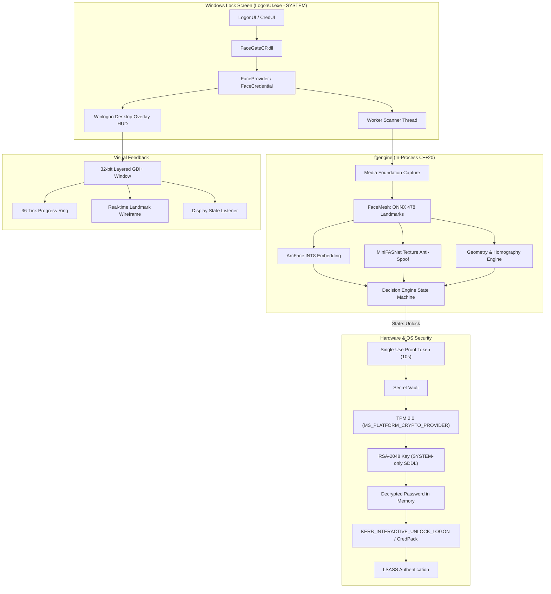
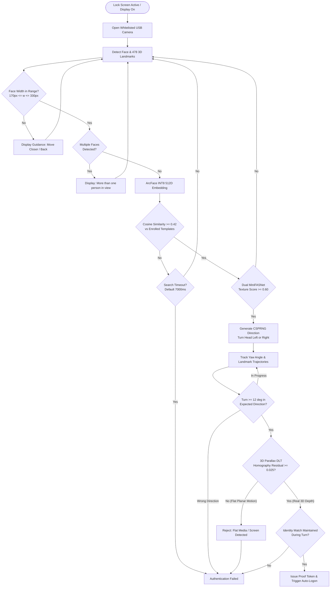

<p align="center">
  
</p>

# FaceGate (winface)

Biometric Face Unlock Credential Provider for Windows 10 and 11.

FaceGate provides fast, secure facial recognition logon for standard RGB webcams without requiring proprietary infrared (IR) sensors. It integrates natively into Windows `LogonUI.exe` using a custom C++20 Credential Provider, backed by hardware TPM 2.0 key isolation, on-device neural network inference, and multi-layered anti-spoofing based on 3D geometric parallax.

---

> **IMPORTANT WARNING AND SAFETY GUARANTEE**
>
> FaceGate **never** hides, modifies, or disables your standard Windows PIN or password tiles.
> If facial verification fails, times out, or the camera is unavailable, you can always click **Sign-in options** on the lock screen and enter your PIN or password as usual.
>
> A complete, offline emergency recovery procedure is included in this repository and installed alongside the binaries in `RECOVERY.md`.

---

## Table of Contents

- [Architectural Overview](#architectural-overview)
- [Security Architecture & Threat Model](#security-architecture--threat-model)
  - [Hardware TPM 2.0 Cryptographic Vault](#1-hardware-tpm-20-cryptographic-vault)
  - [Zero-IPC In-Process Execution](#2-zero-ipc-in-process-execution)
  - [Single-Use Proof Token](#3-single-use-proof-token)
  - [Memory Hygiene](#4-memory-hygiene)
  - [Mathematical 3D Parallax Anti-Spoofing](#5-mathematical-3d-parallax-anti-spoofing)
  - [Camera Hardware Enforcement](#6-camera-hardware-enforcement)
- [System Architecture Diagram](#system-architecture-diagram)
- [Verification & Anti-Spoofing Pipeline](#verification--anti-spoofing-pipeline)
- [Project Layout](#project-layout)
- [Installation Guide](#installation-guide)
- [Command-Line Reference](#command-line-reference)
- [Configuration Settings](#configuration-settings)
- [Troubleshooting & Logs](#troubleshooting--logs)
- [Emergency Recovery Procedure](#emergency-recovery-procedure)

---

## Architectural Overview

Standard Windows Hello Face requires specialized depth-sensing or infrared cameras (850nm/940nm LEDs). Most consumer laptops and external monitors only feature standard 720p or 1080p RGB webcams.

FaceGate bridges this gap by combining modern computer vision with low-level Windows authentication internals:

- **Native Credential Provider V2**: Implements `ICredentialProvider`, `ICredentialProviderCredential2`, and `ICredentialProviderSetUserArray` directly in C++20.
- **In-Process ONNX Inference**: MediaPipe Face Mesh (478 3D landmarks) and ArcFace (512-dimensional embeddings) executed on-device via ONNX Runtime without external runtimes or background daemons.
- **Hardware Cryptography**: User credentials are encrypted using an RSA-2048 key sealed inside the motherboard's Trusted Platform Module (TPM 2.0).
- **Direct Winlogon Overlay**: A 32-bit premultiplied alpha layered window attaches directly to the secure Winlogon desktop, rendering vector-based wireframes and Face ID-style status indicators at ~30 FPS with zero camera pixels displayed or stored.

---

## Security Architecture & Threat Model

### 1. Hardware TPM 2.0 Cryptographic Vault
The Windows password is required by Local Security Authority Subsystem Service (LSASS) to construct an interactive Kerberos or NTLM logon token. Storing credentials insecurely creates a critical vulnerability. FaceGate hardens this storage using the hardware TPM:
- A unique RSA-2048 key is created in the TPM via `MS_PLATFORM_CRYPTO_PROVIDER`.
- When stored, the key's Security Descriptor (DACL) is restricted strictly to Local System (`NT AUTHORITY\SYSTEM`) using the SDDL string `D:P(A;;GA;;;SY)`.
- **Impact**: Even an elevated local Administrator in a standard user session cannot decrypt the stored password. Only `LogonUI.exe` executing as `SYSTEM` on the secure lock screen can access the private key.
- The password file (`%ProgramData%\FaceGate\secret.tpm`) is bound to the physical machine's TPM and is cryptographically useless if copied to another machine.

### 2. Zero-IPC In-Process Execution
Most open-source Windows unlock alternatives run an external background service or Python script communicating over Named Pipes or Localhost HTTP sockets. This introduces a major Local Privilege Escalation (LPE) vector: any process writing an unlock message to the pipe can trigger authentication.
- FaceGate operates **entirely in-process inside `LogonUI.exe`**.
- There are **no listening network ports, no RPC endpoints, and no named pipes**.
- The worker thread and camera handle are spawned on demand when the lock screen wakes and are closed immediately upon unlock or timeout.

### 3. Single-Use Proof Token
Credential serialization cannot be requested arbitrarily:
- The credential provider requires an internal proof token (`take_verified()`).
- This token is set only when the C++ decision engine reaches `State::Unlock`.
- It expires after 10 seconds and is atomically cleared on first access (`verified_at_.exchange(0)`).
- If `LogonUI` requests credential serialization without a fresh proof token, the request is immediately rejected.

### 4. Memory Hygiene
- All in-memory password representations use the RAII struct `SecurePassword`.
- When `SecurePassword` leaves scope, its internal buffer is cleared using `SecureZeroMemory` before deallocation.
- Plaintext passwords are never written to logs, registry values, or temporary disk files.

### 5. Mathematical 3D Parallax Anti-Spoofing
Standard 2D face recognition is vulnerable to presentation attacks (photos, tablet screens, printed masks). FaceGate employs a multi-tiered defense:
- **Dual-Model Texture Classification**: Uses two MiniFASNet models (`fas_v1se` and `fas_v2`) on cropped facial patches to detect moire patterns, screen refresh artifacts, and paper textures.
- **CSPRNG Challenge**: The engine requests a random head turn (LEFT or RIGHT) generated from `BCryptGenRandom`. An attacker playing a pre-recorded video cannot predict the requested direction.
- **3D Parallax DLT Homography Residual**: When a flat photo or phone screen is rotated in front of a camera, all facial landmarks transform according to a planar projective homography:
  
  $$\mathbf{x}' \sim \mathbf{H}\mathbf{x}$$

  A real human face has physical depth: the nose tip, eye sockets, and jawline exist on distinct geometric planes. Rotating a real head introduces 3D perspective parallax that breaks any 2D planar homography. By fitting a Direct Linear Transformation (DLT) homography to the landmark correspondences and measuring the median residual:
  
  $$\text{Residual} = \text{median}\left(\frac{\|\mathbf{H}\mathbf{x}_i - \mathbf{x}'_i\|}{\text{face\_width}}\right)$$

  If $\text{Residual} < 0.025$, the rotation is geometrically flat and rejected as a photo/screen attack.

### 6. Camera Hardware Enforcement
- Software cameras (OBS Virtual Camera, ManyCam, DroidCam, etc.) create virtual device links such as `swd#` or `root#`.
- FaceGate enforces `\\?\usb#` hardware prefix validation and matches the configured vendor/product ID (VID/PID). Any virtual or spoofed camera source is refused.

---

## System Architecture Diagram



---

## Verification & Anti-Spoofing Pipeline



---

## Project Layout

```
facegate/
├── CMakeLists.txt         # Build definition (C++20, static CRT, CFG, SDL, DelayLoad)
├── cp/                    # Credential Provider (loaded by LogonUI.exe)
│   ├── common.h / .cpp    # Configuration and shared logging
│   ├── credential.h /.cpp # ICredentialProviderCredential2 implementation
│   ├── dll.cpp            # COM exports (DllGetClassObject, DllCanUnloadNow)
│   ├── helpers.h / .cpp   # LSA package negotiation and serialization
│   ├── overlay.h / .cpp   # GDI+ layered HUD on Winlogon desktop
│   ├── provider.cpp       # ICredentialProvider and ICredentialProviderSetUserArray
│   ├── scanner.h / .cpp   # Camera/engine worker thread lifecycle
│   └── secret.h / .cpp    # TPM 2.0 RSA-2048 and DPAPI cryptography
├── engine/                # Core biometric and computer vision engine
│   ├── camera.h / .cpp    # Media Foundation hardware webcam capture
│   ├── decide.h / .cpp    # Unlock decision state machine and challenge logic
│   ├── facemesh.h / .cpp  # MediaPipe Face Landmarker on ONNX Runtime
│   ├── geom.h / .cpp      # Bilinear affine warp, Umeyama alignment, DLT homography
│   ├── image.h            # Lightweight contiguous BGR image buffer
│   ├── onnx.h / .cpp      # ONNX Runtime environment and session wrappers
│   ├── profiles.h / .cpp  # Binary template profile serialization
│   └── recog.h / .cpp     # ArcFace embeddings and MiniFASNet anti-spoofing
├── tools/                 # Administrative and testing utilities
│   ├── fgcli.cpp          # Engine self-test against reference test vectors
│   ├── fgcredtest.cpp     # CredUI prompt test harness (non-destructive)
│   └── fgsetup.cpp        # Enrollment, password vaulting, settings CLI
├── install/               # Installation and recovery scripts
│   ├── install.ps1        # Admin deployment and registry registration
│   ├── uninstall.ps1      # Safe removal script
│   └── RECOVERY.md        # Offline BitLocker and recovery console procedures
└── bench/                 # Calibration and validation toolset
    ├── calibrate.py       # LFW dataset calibration over 13,000 stranger faces
    └── unlock_test.py     # Live benchmark harness with telemetry logging
```

---

## Installation Guide

### Prerequisites
- **Operating System**: Windows 10 (64-bit) or Windows 11 (64-bit).
- **Hardware**: Standard USB webcam (built-in laptop webcam or external USB camera).
- **Security**: Motherboard TPM 2.0 enabled.
- **Build Tools**: Visual Studio 2022 with C++ desktop workload and CMake 3.20+.

### 1. Build the Binaries
Open a terminal in the repository root:

```powershell
cmake -B build -S . -DCMAKE_BUILD_TYPE=Release
cmake --build build --config Release
```

The compiled binaries will be generated in `build\Release`:
- `FaceGateCP.dll` (Credential Provider)
- `fgsetup.exe` (Management tool)
- `fgcredtest.exe` (CredUI test tool)
- `fgcli.exe` (Self-test CLI)

### 2. Run Engine Verification
Run the offline vector test to confirm neural network alignment and mathematical parity:

```powershell
.\build\Release\fgcli.exe selftest
```

### 3. Install to System
Launch an **Administrator PowerShell** and run:

```powershell
powershell -ExecutionPolicy Bypass -File .\install\install.ps1
```

This installs binaries to `C:\Program Files\FaceGate`, creates the protected data directory `C:\ProgramData\FaceGate`, registers the COM class `{C188DC15-E41E-4CCF-9DA9-8238E1D0BBDF}`, and registers the provider in disabled state (`Enabled = 0`).

---

## Command-Line Reference

All configuration commands must be executed from an **Administrator PowerShell**.

### Check System Status
Displays the active operational mode, enrolled face count, password status, whitelisted camera ID, and runtime parameters:

```powershell
& "C:\Program Files\FaceGate\fgsetup.exe" status
```

### Enroll a Face
Enrolls a face profile. The interactive terminal guides you through 5 head poses (Straight, Turn Left, Turn Right, Tilt Up, Tilt Down), capturing 15 frames per pose. You can enroll up to 3 distinct profiles (e.g., standard, with glasses, or secondary user):

```powershell
& "C:\Program Files\FaceGate\fgsetup.exe" enroll nyx41
```

To enroll a second profile:

```powershell
& "C:\Program Files\FaceGate\fgsetup.exe" enroll glasses
```

### Delete a Face Profile
Removes a specific enrolled profile by name:

```powershell
& "C:\Program Files\FaceGate\fgsetup.exe" remove glasses
```

### Store / Update Windows Password
Prompts for your Windows password (hidden input), validates it with the operating system via `LogonUser`, provisions an RSA-2048 key in the TPM, restricts the key to `SYSTEM`, and saves the encrypted payload:

```powershell
& "C:\Program Files\FaceGate\fgsetup.exe" password
```

> **Note**: You must re-run this command whenever you change your Windows account password.

### Verify Password Vault
Tests whether the stored credential is valid with the Windows authentication authority without displaying it (does not require admin elevation):

```powershell
& "C:\Program Files\FaceGate\fgsetup.exe" verify
```

### Operational Modes

Turn FaceGate completely off:
```powershell
& "C:\Program Files\FaceGate\fgsetup.exe" mode off
```

Enable safe test mode (appears only in the CredUI Windows Security prompt, not on the lock screen):
```powershell
& "C:\Program Files\FaceGate\fgsetup.exe" mode test
```

Enable full lock-screen authentication:
```powershell
& "C:\Program Files\FaceGate\fgsetup.exe" mode lock
```

### Non-Destructive Live Test
Runs a full verification cycle (webcam feed, face tracking, liveness check, and head turn challenge) directly in your console without locking your computer:

```powershell
& "C:\Program Files\FaceGate\fgsetup.exe" test
```

---

## Configuration Settings

Parameters can be adjusted in the registry using `fgsetup set <Parameter> <Value>`:

| Parameter | Default | Valid Range | Description |
| :--- | :---: | :---: | :--- |
| `SearchMs` | `7000` | `3000` - `15000` | Milliseconds to search for a matching face before timing out. |
| `ChallengeMs` | `3000` | `2000` - `6000` | Milliseconds allowed for the user to complete the head-turn challenge. |
| `MaxFails` | `3` | `1` - `5` | Consecutive failed recognitions before falling back exclusively to PIN/password. |
| `Strictness` | `0` | `0` - `2` | Recognition threshold: `0` = Balanced (0.42), `1` = Strict (0.48), `2` = Relaxed (0.38). |
| `Sounds` | `1` | `0` or `1` | Play audio feedback cues on scan, success, and rejection (`assets/*.wav`). |
| `Camera` | Auto | Device ID | Whitelist substring for the specific USB camera to use. |

Examples:

```powershell
& "C:\Program Files\FaceGate\fgsetup.exe" set SearchMs 8000
& "C:\Program Files\FaceGate\fgsetup.exe" set Sounds 0
& "C:\Program Files\FaceGate\fgsetup.exe" set MaxFails 3
```

---

## Troubleshooting & Logs

To inspect authentication events, camera open timings, and failure reasons:

```powershell
Get-Content C:\ProgramData\FaceGate\log.txt -Tail 30
```

To list all detected video capture devices and verify USB hardware qualification:

```powershell
& "C:\Program Files\FaceGate\fgsetup.exe" cameras
```

---

## Uninstallation

To completely remove FaceGate from the lock screen, delete the registered COM CLSID, and wipe all local face profiles, logs, and TPM keys:

```powershell
powershell -ExecutionPolicy Bypass -File .\install\uninstall.ps1
```

If Windows reports that `FaceGateCP.dll` is currently held open by `LogonUI.exe`, the uninstaller unregisters the provider immediately and marks the DLL for deletion. Restart the machine once to complete removal. Your Windows PIN and password will remain functional throughout the process.

---

## Emergency Recovery Procedure

If a configuration error or driver issue prevents the lock screen from behaving properly:

### Level 1: System is Booted and Accessible
If you can sign in using your PIN or password:
1. Open an Administrator terminal.
2. Disable FaceGate:
   ```powershell
   & "C:\Program Files\FaceGate\fgsetup.exe" mode off
   ```
3. Or run the uninstaller:
   ```powershell
   powershell -ExecutionPolicy Bypass -File .\install\uninstall.ps1
   ```

### Level 2: Lock Screen Inaccessible (Recovery Environment)
1. On the Windows sign-in screen, hold **Shift** and select **Power > Restart**.
2. Select **Troubleshoot > Advanced options > Command Prompt**.
3. If BitLocker is enabled, enter your 48-digit BitLocker recovery key when prompted (or unlock via `manage-bde -unlock C: -RecoveryPassword YOUR-KEY`).
4. Identify your primary Windows drive (in recovery mode, Windows is often mounted on `D:`).
5. Load the offline registry hive and remove the FaceGate Credential Provider registration:
   ```cmd
   reg load HKLM\OFFSOFT C:\Windows\System32\config\SOFTWARE
   reg delete "HKLM\OFFSOFT\Microsoft\Windows\CurrentVersion\Authentication\Credential Providers\{C188DC15-E41E-4CCF-9DA9-8238E1D0BBDF}" /f
   reg unload HKLM\OFFSOFT
   ```
6. Type `exit` and select **Continue** to boot into Windows. The default Windows sign-in screen will be restored.

---

## License

This project is licensed under the Apache License 2.0. Third-party neural network architectures and models (MediaPipe, ArcFace, MiniFASNet) belong to their respective authors and are subject to their respective licenses.
